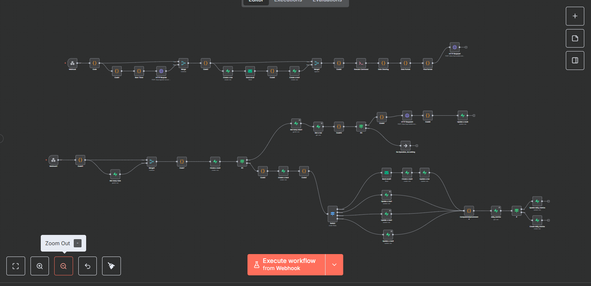

# AI Lead Gen Outreach Automation Engine

This is my take on automating the entire lead generation pipeline - from getting prospect data to actually calling them and following up. Built with n8n because I wanted something visual and didn't feel like writing a ton of backend code.

Basically, it takes prospect info, generates personalized LinkedIn messages using Gemini, scrapes their LinkedIn profile, makes an AI voice call via Retell, analyzes the call outcome, and sends follow-up emails automatically. Pretty neat if you ask me.

## What it does

So the workflow basically:
- Generating personalized outreach sequences using Google Gemini (way better than templates)
- Scraping LinkedIn profiles to get more context about prospects
- Making actual voice calls using Retell AI (the AI actually sounds human, it's wild)
- Analyzing call transcripts to figure out if they're interested, booked, rejected, etc.
- Sending follow-up emails based on what happened in the call
- Retrying failed calls automatically (up to 2 times)
- Tracking all the metrics you care about

This was just a personal project I started because I thought it'd be cool to automate the whole outreach process. I used real estate as the example use case in the call scripts, but you can easily adapt it for any B2B sales scenario - SaaS, consulting, whatever. The core idea is just automating outreach without needing to hire a call center.

## Tech Stack

- **n8n** - The workflow engine. Love the visual interface, makes debugging way easier
- **Supabase** - Database for storing everything. PostgreSQL with a nice API, can't complain
- **Retell AI** - For the voice calls. Their API is solid and the voice quality is actually good
- **Google Gemini** - Via a Vercel endpoint. Generates the outreach sequences
- **LinkedIn Scraper** - Custom CLI tool I'm using (you'll need to set this up separately)
- **SMTP** - For sending emails (using Gmail SMTP but you can use whatever)

## Getting Started

### What you need first
- Docker installed (obviously)
- A Supabase account (free tier works fine)
- Retell AI API key (they have a free trial)
- SMTP credentials (Gmail works, or use SendGrid/Mailgun)
- The LinkedIn scraper CLI installed somewhere accessible

### Installing

First, clone the repo:
```bash
git clone https://github.com/gopikrishna818/AI-Lead-Gen-Outreach-Automation-Engine.git
cd AI-Lead-Gen-Outreach-Automation-Engine
```

2. Build the Docker image:
```bash
docker build -t ai-lead-gen-engine .
```

3. Run it:
```bash
docker run -d \
  -p 5678:5678 \
  -e N8N_BASIC_AUTH_ACTIVE=true \
  -e N8N_BASIC_AUTH_USER=admin \
  -e N8N_BASIC_AUTH_PASSWORD=your-password-here \
  -e PORT=5678 \
  ai-lead-gen-engine
```

4. Open n8n at `http://localhost:5678` - the workflow should auto-import on first run

### Setting up credentials

Alright, now you gotta configure a few things in n8n:

**Supabase:**
- Go to Credentials → Add Supabase
- Paste your Supabase URL and anon key
- You'll need to create the tables first (I'll list them below)

**Retell AI:**
- Get your API key from their dashboard
- Add it as a Bearer Token credential in n8n
- The voice ID is hardcoded in the workflow (`agent_bdf7d7b13d952dfc68cba2a52d`) - change it if you want

**SMTP:**
- Add SMTP credentials in n8n
- I'm using Gmail with an app password, but any SMTP provider works
- Update the `from_email` in the workflow nodes if needed

**Gemini API:**
- The endpoint is currently pointing to `https://gemini-server-wheat.vercel.app/generate`
- You might want to deploy your own or update this URL

**LinkedIn Scraper:**
- Update the path in the "LinkedIn Scraper" node
- Currently set to `/Users/admin/OneDrive/Desktop/linkedin-scraper/cli.js` - change this to wherever yours is

## How it works

There are basically two paths through the workflow:

### Path 1: New Prospect → Call

1. Webhook receives prospect data (name, email, phone, company, LinkedIn URL)
2. Validates the required fields
3. Calls Gemini API to generate a personalized LinkedIn outreach sequence
4. Saves everything to Supabase
5. Sends an email with the generated sequence (optional, you can disable this)
6. Scrapes LinkedIn profile for more data
7. Generates a personalized call script based on all the data
8. Makes the call via Retell AI

### Path 2: Call Analysis → Follow-up

1. Retell sends a webhook when the call ends
2. The workflow parses the transcript and figures out:
   - Did they book an appointment? (extracts date/time from natural language)
   - Are they interested?
   - Did they reject?
   - Was it voicemail/no answer?
3. Saves/updates the call log
4. Routes to appropriate action:
   - **Interested** → Sends case studies email
   - **Booked** → Updates with appointment time
   - **Rejected** → Marks as rejected, stops outreach
   - **Unknown** → Flags for manual review
5. If it was voicemail/no answer and attempts < 2, retries the call
6. Updates daily metrics

The appointment extraction is pretty cool - it can parse things like "next Tuesday at 3pm" or "August 26th at 11:30am" from the transcript. Not perfect but works most of the time.

## API Stuff

### Adding a prospect

Hit this endpoint with a POST request:

**POST** `/webhook/2198f95f-00a7-4d60-a9cb-160e5a0061ea`

Body should look like:
```json
{
  "firstName": "John",
  "lastName": "Doe",
  "email": "john@example.com",
  "phoneNumber": "+1234567890",
  "companyName": "Acme Corp",
  "website": "https://acme.com",
  "linkedInURL": "https://linkedin.com/in/johndoe"
}
```

### Call analysis webhook

**POST** `/webhook/retell-call-analysis`

Retell calls this automatically when a call ends, so you don't need to worry about it.

## Database stuff

Using Supabase (it's just PostgreSQL). Here are the tables you need:

**outreach_data** - Stores prospect info and AI-generated sequences
- id, firstName, lastName, email, PhoneNumber, companyName, website, linkedInURL, aiResponse, timestamp

**call_logs** - All call data
- id, retell_call_id, phone_number, start_timestamp, end_timestamp, disconnection_reason, outcome, transcript, summary, is_voicemail, email_sent, appointment_time, next_step, attempts, etc.

**email_logs** - Tracks sent emails
- id, call_log_id, prospect_id, from_email, to_email, subject, sent_at

**daily_metrics** - Aggregated stats
- metric_date, calls_sent, calls_picked_up, booked_appointments, rejected_offers, emails_sent, etc.

**call_analysis_events** - Call analysis metadata
- retell_call_id, analyzed_at, outcome, extra (jsonb)

**api_logs** - API performance tracking
- apiName, status, timeTaken, timestamp

You'll need to create these in Supabase. The schema is pretty simple - mostly text fields, timestamps, and some booleans. I don't have the exact SQL handy but the field names should be obvious from the descriptions above.

## Quick example

Here's how you'd add a prospect:

```bash
curl -X POST http://localhost:5678/webhook/2198f95f-00a7-4d60-a9cb-160e5a0061ea \
  -H "Content-Type: application/json" \
  -d '{
    "firstName": "Jane",
    "lastName": "Smith",
    "email": "jane@example.com",
    "phoneNumber": "+1234567890",
    "companyName": "Tech Corp",
    "website": "https://techcorp.com",
    "linkedInURL": "https://linkedin.com/in/janesmith"
  }'
```

Then check n8n to watch it run, or just query Supabase to see what happened.

## Screenshots

### Workflow Overview

Here's what the n8n workflow looks like - it's basically a spider web of connected nodes that handle the entire automation:



You can see the main paths - prospect stuff on top, call analysis in the middle, follow-ups at the bottom. All the integrations are there - Gemini, Retell, Supabase, the scraper, etc.


## Troubleshooting

**Workflow not running?**
- Check n8n execution logs (click on any node to see what happened)
- Make sure all credentials are set up correctly
- Verify the webhook URL is correct

**Calls not happening?**
- Check your Retell API key
- Make sure phone numbers include country code (+1 for US)
- Check your Retell account balance

**Emails not sending?**
- Verify SMTP credentials
- Check if your email provider has rate limits
- Look at the email node logs in n8n

**LinkedIn scraper failing?**
- Make sure the path is correct in the workflow
- Check that the scraper CLI has execute permissions
- Verify the LinkedIn URL format

**Database errors?**
- Double-check your Supabase URL and API key
- Make sure all tables exist
- Check table permissions (RLS policies might be blocking)

## Things that could be better

- Appointment time extraction sometimes misses weird date formats
- LinkedIn scraper path is hardcoded (annoying, I know)
- Retry logic is capped at 2 attempts - might want to make that configurable
- No rate limiting on the webhook (could be a problem at scale)
- The Gemini prompt is tuned for real estate, might need tweaking for other industries

## Contributing

PRs welcome. Would especially love help with:
- Making appointment extraction less janky
- Better error handling (it's pretty basic right now)
- More integrations
- Making it faster

## Credits

Shoutout to:
- n8n (workflow engine)
- Retell AI (voice calls)
- Google Gemini (content generation)
- Supabase (database)

Couldn't have built this without these tools.

---

If you end up using this and it works (or completely breaks), hit me up. Would love to hear what you're doing with it.
